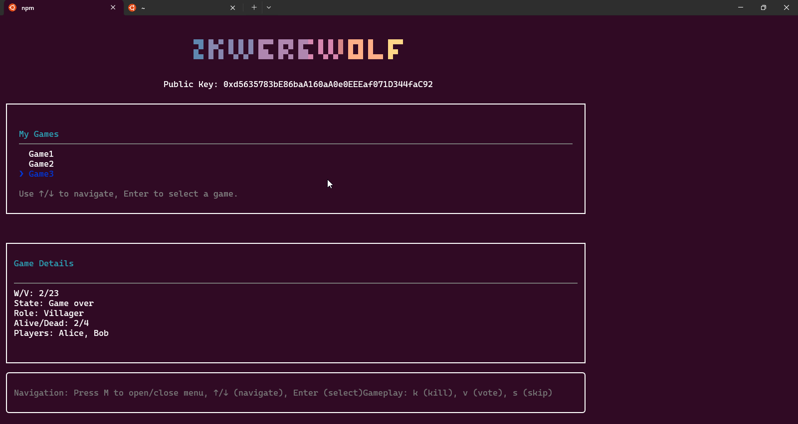

# zkWerewolf

### A privacy-preserving game of Werewolf on the blockchain

This project implements a decentralized version of the classic social deduction game **Werewolf** using **Zero-Knowledge Proofs (ZKPs)** and **Homomorphic Encryption** to maintain player privacy on a public blockchain.

## 📼 Video Walkthrough

**Watch the full walkthrough**: [https://drive.google.com/file/d/14VC4bRWabFiaamMBCY4_XfqQjTOgLzW6/view?usp=sharing](https://drive.google.com/file/d/14VC4bRWabFiaamMBCY4_XfqQjTOgLzW6/view?usp=sharing)

## 🛠️ Installation & Setup

To run this project, you'll need to install the following dependencies.

  * **Forge**: A fast, all-in-one Ethereum testing framework. **[Install Forge](https://book.getfoundry.sh/getting-started/installation)**
  * **Noir**: A Rust-based language for writing and proving Zero-Knowledge programs. **[Install Noir](https://www.google.com/search?q=https://noir-lang.org/getting_started/installation)**
  * **Node.js**: A JavaScript runtime environment.
  * **npm**: The Node.js package manager.

### Steps

1.  Clone the repository and navigate to the project directory.
2.  Install the project's dependencies: `npm install`
3.  'Package' the game: `./packageGame.sh`
4.  For optimal display, set your terminal size to **1680 X 682**.
5. Run with `npm run show`

## 🎮 How it Works

In a traditional game of Werewolf, villagers try to identify the werewolves and vote them out, while werewolves attempt to eliminate as many villagers as possible. The core of the game is **incomplete information**—no user knows the role of any other user.

To preserve this crucial element of secrecy on a public chain where all data is transparent, we use a combination of ZKPs and Homomorphic Encryption.

1. **Role Assignment**: An admin creates a game, assigns roles, and manages the game state. Each player's role is **encrypted** with their public key (homomorphic encryption) and stored on the blockchain, only accessible to them.

2. **Valid Moves**: Since players' roles are hidden, how can we verify if a move is valid? Players must generate a **Zero-Knowledge Proof (ZKP)** that a specific action they're taking is valid **without revealing their role**. This proof, known as a **move commitment**, is submitted and verified by the game admin.

3. **Game State**: Admin tracks game state, and based on user move commitments and roles:
    - reveals which users have been killed,

    - which werewolves have been discovered and,

    - if the game is over

  The admin creates a zkp proving this information as well.

## Folder Structure and Files
- `contracts` -> Foundry project, with smart contract and tests

- `contracts/circuits/GameSetup` -> Game Creation zkp circuit

- `contracts/circuits/MoveCommit` -> Create a new move zkp circuit

- `source/app.js` -> Ink TUI Application

- `source/hooks.js` -> Custom Ink TUI hooks for interacting with smart contract and circuits

- `source/services.js` -> Demo services for interacting with the UI

- `source/services.new.js` -> Service functions and helpers that actually interact with the blockchain

- `source/zkp.js` -> Partially integrated zkVerify API for verifying proofs